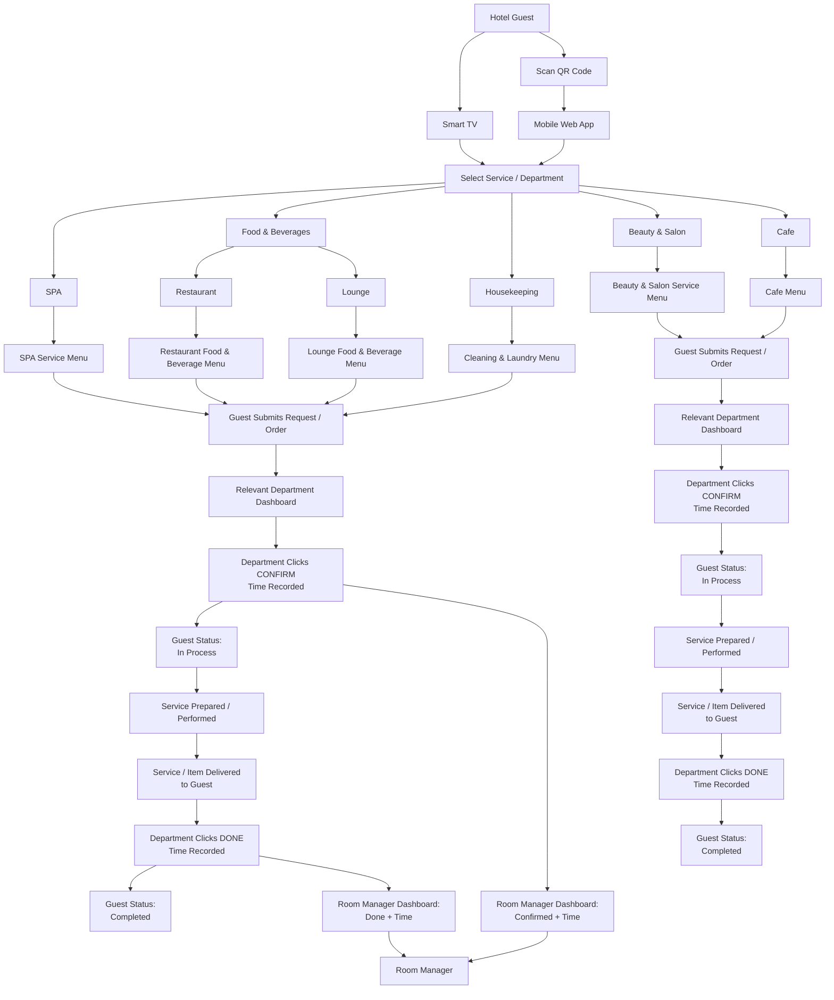

# Scope of Work (SoW)
## Hotel Guest Service Platform — MVP

**Version:** 1.0  
**Scope:** Minimum Viable Product (MVP)  
**Basis:** High-level operational flow yang telah disepakati  
**Tujuan utama:** Menyediakan satu platform layanan hotel yang dapat digunakan guest dari Smart TV maupun smartphone, lalu meneruskan request/order ke dashboard unit terkait dengan alur `Submit → Confirm → In Process → Done → Completed`.

---

# 1. Gambaran Umum

Aplikasi ini adalah platform layanan guest di kamar hotel.

Guest dapat mengakses layanan melalui dua channel:

1. **Smart TV di kamar**
2. **QR Code di kamar → Mobile Web App**

Guest kemudian dapat memilih layanan dari:

- SPA
- Food & Beverages
  - Restaurant
  - Lounge
- Housekeeping
- Beauty & Salon
- Cafe

Setiap unit mempunyai menu layanan atau menu produk masing-masing.

Food & Beverages adalah pengelompokan layanan guest. Untuk operasional internal,
Restaurant dan Lounge memiliki akun, dashboard, permission scope, dan API scope
yang terpisah.

Contoh:
- Restaurant → makanan dan minuman.
- Lounge → menu lounge.
- Housekeeping → cleaning, laundry, dan kebutuhan kamar.
- SPA → layanan SPA.
- Beauty & Salon → layanan kecantikan/salon.
- Cafe → menu cafe.

Setelah guest submit request/order, request akan masuk ke dashboard unit yang sesuai.

---

# 2. Tujuan MVP

MVP harus sudah berguna untuk operasional hotel, bukan hanya prototype.

MVP harus memungkinkan:

1. Guest memilih layanan dari TV atau smartphone.
2. Guest submit request/order.
3. Request otomatis masuk ke dashboard unit yang tepat.
4. Unit terkait melakukan **Confirm**.
5. Waktu Confirm tercatat sampai jam dan menit.
6. Guest melihat status **In Process**.
7. Unit menyelesaikan layanan/order.
8. Unit melakukan **Done**.
9. Waktu Done tercatat sampai jam dan menit.
10. Guest melihat status **Completed**.
11. Room Manager dapat memonitor unit yang masuk ke scope monitoring.
12. Beauty & Salon dan Cafe tetap berjalan secara independen tanpa masuk ke monitoring Room Manager.

---

# 3. Struktur Layanan

```text
Hotel Guest
│
├── SPA
│   └── SPA Service Menu
│
├── Food & Beverages
│   ├── Restaurant
│   │   └── Restaurant Menu
│   └── Lounge
│       └── Lounge Menu
│
├── Housekeeping
│   └── Cleaning & Laundry Menu
│
├── Beauty & Salon
│   └── Beauty & Salon Service Menu
│
└── Cafe
    └── Cafe Menu
```

---

# 4. Scope Monitoring Room Manager

## Masuk ke Room Manager Dashboard

- SPA
- Restaurant
- Lounge
- Housekeeping

Room Manager dapat melihat minimum:

- Room number.
- Department/unit.
- Item atau layanan.
- Request time.
- Current status.
- Confirm time.
- Done time.

## Tidak Masuk ke Room Manager Dashboard

- Beauty & Salon
- Cafe

Kedua unit tetap menggunakan alur Confirm dan Done, tetapi aktivitasnya tidak ditampilkan ke Room Manager.

---

# 5. High-Level Flow



---

# 6. Komponen Aplikasi MVP

MVP terdiri dari:

1. Guest Smart TV Application
2. Guest Mobile Responsive Web Application
3. Room Manager Dashboard
4. SPA Dashboard
5. Restaurant Dashboard
6. Lounge Dashboard
7. Housekeeping Dashboard
8. Beauty & Salon Dashboard
9. Cafe Dashboard
10. Menu / Service Management
11. Backend Application
12. Database
13. Media Storage jika menu menggunakan gambar

---

# 7. Guest Smart TV Application

Guest dapat:

- Membuka aplikasi dari Smart TV.
- Melihat seluruh menu layanan.
- Memilih unit.
- Memilih item/service.
- Mengatur quantity jika relevan.
- Menambahkan note jika disediakan.
- Submit request/order.
- Melihat status request.

Smart TV UI harus dapat digunakan dengan remote:

- Up
- Down
- Left
- Right
- OK / Select
- Back

Guest tidak membutuhkan username/password.

---

# 8. Guest Mobile Web Application

Guest melakukan:

```text
Scan QR Code
→ Browser terbuka
→ Guest Service App
```

Requirement:

- Responsive untuk smartphone.
- Touch-friendly.
- Menu dan layanan konsisten dengan Smart TV.
- QR harus membawa identitas kamar.
- Guest tidak perlu mengetik nomor kamar secara manual.
- Guest dapat submit request/order.
- Guest dapat melihat status request.

Native iOS/Android app tidak dibutuhkan untuk MVP.

---

# 9. Room Identification

Semua request harus terhubung dengan kamar.

## Smart TV

```text
Smart TV / Device
→ mapped ke Room
```

## QR Code

```text
QR Code
→ mapped ke Room
```

Contoh mapping internal:

```text
TV-0032 → Room 302
opaque QR token → Room 302
```

QR payload menggunakan URL Guest dengan opaque token, bukan nomor kamar.
Token disimpan sebagai hash dan hanya menghasilkan context ketika kamar
memiliki active guest assignment. Dengan begitu, department tetap mengetahui
request berasal dari kamar mana tanpa mengekspos identitas kamar pada QR URL.

---

# 10. Guest Service Selection

Guest dapat memilih:

### SPA
Menampilkan SPA Service Menu.

### Food & Beverages
Menampilkan:
- Restaurant
- Lounge (disabled sampai menu resmi tersedia)

### Housekeeping
Menampilkan menu cleaning/laundry/kebutuhan kamar.

### Beauty & Salon
Menampilkan service menu Beauty & Salon.

### Cafe
Menampilkan Cafe Menu.

---

# 11. SPA Menu

Minimum data setiap layanan:

- Service name.
- Description.
- Price jika digunakan.
- Duration jika digunakan.
- Image jika digunakan.
- Availability / active status.

Detail daftar layanan ditentukan oleh hotel.

---

# 12. Restaurant Menu

Minimum data:

- Item name.
- Description.
- Price.
- Image jika digunakan.
- Availability.
- Quantity support.

---

# 13. Lounge Menu

Lounge merupakan bagian dari **Food & Beverages** untuk layanan guest, tetapi
mempunyai menu dan pengelolaan internal sendiri.

Menu Lounge belum diberikan pada prerequisite ini. Karena itu Lounge tetap
ditampilkan sebagai unit disabled dengan alasan `MENU_NOT_CONFIGURED` dan tidak
dapat dibuka atau dipesan sampai katalog resminya tersedia.

Jika katalog Lounge sudah dikonfigurasi, minimum data:

- Item name.
- Description.
- Price.
- Image jika digunakan.
- Availability.
- Quantity support.

Aktivitas Lounge masuk ke Room Manager Dashboard.

---

# 14. Housekeeping Menu

Contoh layanan:

- Room Cleaning
- Laundry
- Towel Request
- Extra Pillow
- Toiletries
- Trash Collection
- Other Room Assistance

Minimum data:

- Service name.
- Description.
- Price jika layanan berbayar.
- Availability.

Daftar final mengikuti kebutuhan hotel.

---

# 15. Beauty & Salon Menu

Minimum data:

- Service name.
- Description.
- Price jika digunakan.
- Duration jika digunakan.
- Image jika digunakan.
- Availability.

Beauty & Salon tidak masuk ke Room Manager Dashboard.

---

# 16. Cafe Menu

Cafe adalah unit tersendiri dalam scope aplikasi.

Minimum data:

- Item name.
- Description.
- Price.
- Image jika digunakan.
- Availability.
- Quantity support.

Cafe tidak masuk ke Room Manager Dashboard.

---

# 17. Standard Operational Flow

Semua unit menggunakan pola yang sama:

```text
NEW REQUEST
    ↓
CONFIRM
    ↓
IN PROCESS
    ↓
SERVICE / ORDER FULFILLMENT
    ↓
DONE
    ↓
COMPLETED
```

Perbedaannya hanya:

- Menu yang ditampilkan.
- Dashboard tujuan.
- Apakah aktivitas masuk Room Manager Dashboard.

---

# 18. New Request

Saat guest submit:

1. Request dibuat.
2. Request time tercatat.
3. Request diarahkan ke unit yang benar.
4. Department dashboard menampilkan request baru.
5. Room number harus terlihat.
6. Status awal adalah `NEW`.

Contoh:

```text
Room: 302
Unit: Restaurant
Order: Nasi Goreng
Quantity: 1
Requested: 14:05
Status: New
```

---

# 19. Confirm

Department harus klik **CONFIRM** ketika request sudah diterima dan mulai diproses.

Saat Confirm:

1. Status berubah menjadi `IN_PROCESS`.
2. Confirm time tercatat.
3. Guest melihat **In Process**.

Jika unit adalah:
- SPA
- Restaurant
- Lounge
- Housekeeping

maka Confirm + waktu juga masuk ke Room Manager Dashboard.

Jika unit adalah:
- Beauty & Salon
- Cafe

maka Confirm tidak masuk ke Room Manager Dashboard.

---

# 20. Fulfillment

Setelah Confirm, unit melakukan pekerjaan operasional.

Contoh Restaurant:

```text
Order diterima
→ makanan dibuat
→ dibawa ke kamar
→ diberikan ke guest
```

Contoh Housekeeping:

```text
Request diterima
→ staff menuju kamar
→ service dilakukan
→ selesai
```

Detail SOP internal masing-masing department bukan bagian dari aplikasi MVP.

---

# 21. Done

Department klik **DONE** hanya setelah item/service benar-benar selesai diberikan.

Saat Done:

1. Status berubah menjadi `COMPLETED`.
2. Done time tercatat.
3. Guest melihat **Completed**.

Untuk SPA, Restaurant, Lounge, dan Housekeeping:
- Done + waktu masuk Room Manager Dashboard.

Untuk Beauty & Salon dan Cafe:
- Done tidak masuk Room Manager Dashboard.

---

# 22. Status MVP

Minimum status:

| Status | Trigger |
|---|---|
| `NEW` | Guest submit |
| `IN_PROCESS` | Department klik Confirm |
| `COMPLETED` | Department klik Done |

MVP tidak membutuhkan workflow status yang lebih kompleks.

---

# 23. Timestamp

Minimum timestamp yang wajib disimpan:

- Request Created Time
- Confirm Time
- Done Time

Format minimum:

```text
Date
Hour
Minute
```

Contoh:

```text
Requested: 29 Aug 2026, 14:05
Confirmed: 29 Aug 2026, 14:08
Done: 29 Aug 2026, 14:31
```

Timestamp harus tetap tersimpan di history.

---

# 24. Guest Request Status

Guest dapat melihat:

- Item/service.
- Department/unit.
- Request time.
- Current status.
- Completion time setelah selesai.

Contoh:

```text
Nasi Goreng
Restaurant

Requested: 14:05
Status: In Process
```

Setelah selesai:

```text
Nasi Goreng
Restaurant

Requested: 14:05
Completed: 14:31
Status: Completed
```

---

# 25. Department Dashboard — General

Setiap department dashboard minimum memiliki:

- Login.
- Incoming requests.
- Room number.
- Item/service detail.
- Request time.
- Current status.
- Confirm action.
- Confirm time.
- Done action.
- Done time.
- Request history.
- Basic filter.

---

# 26. SPA Dashboard

SPA hanya dapat:

- Melihat SPA request.
- Confirm SPA request.
- Done SPA request.
- Melihat SPA history.

SPA tidak dapat melihat request unit lain.

SPA activity masuk Room Manager Dashboard.

---

# 27. Restaurant dan Lounge Dashboard

Restaurant dan Lounge tetap berada dalam pengelompokan Food & Beverages untuk
layanan guest, tetapi dashboard internalnya dipisah. Setiap dashboard hanya
boleh mengakses request dan menu unitnya sendiri.

Minimum:

- Restaurant request list pada Restaurant Dashboard.
- Lounge request list pada Lounge Dashboard.
- Confirm.
- Done.
- Timestamp.
- History.
- Filter berdasarkan room dan status.

Restaurant dan Lounge activity masuk Room Manager Dashboard.

---

# 28. Housekeeping Dashboard

Housekeeping hanya dapat:

- Melihat Housekeeping request.
- Confirm.
- Done.
- Melihat history.
- Filter request.

Housekeeping activity masuk Room Manager Dashboard.

---

# 29. Beauty & Salon Dashboard

Beauty & Salon hanya dapat:

- Melihat Beauty & Salon request.
- Confirm.
- Done.
- Melihat history.

Beauty & Salon activity tidak terlihat oleh Room Manager.

---

# 30. Cafe Dashboard

Cafe hanya dapat:

- Melihat Cafe order/request.
- Confirm.
- Done.
- Melihat history.

Cafe activity tidak terlihat oleh Room Manager.

---

# 31. Room Manager Dashboard

Room Manager berfungsi sebagai **monitoring**, bukan department executor.

Room Manager dapat melihat:

- SPA.
- Restaurant.
- Lounge.
- Housekeeping.

Room Manager tidak dapat melihat:

- Beauty & Salon.
- Cafe.

Minimum information:

- Room number.
- Unit.
- Item/service.
- Request time.
- Current status.
- Confirm time.
- Done time.

---

# 32. Room Manager Example

| Room | Unit | Item/Service | Requested | Confirmed | Done | Status |
|---|---|---|---|---|---|---|
| 302 | Restaurant | Nasi Goreng | 14:05 | 14:08 | - | In Process |
| 417 | Housekeeping | Laundry | 14:10 | 14:12 | 14:40 | Completed |
| 215 | SPA | SPA Service | 15:00 | 15:03 | - | In Process |

---

# 33. RBAC

Minimum roles:

1. Superadmin
2. Room Manager
3. Receptionist
4. SPA
5. Restaurant
6. Lounge
7. Housekeeping
8. Beauty & Salon
9. Cafe

### RBAC — Superadmin

Dapat:

- CRUD staff user.
- CRUD role.
- Mendaftarkan email staff.
- Membuat dan mereset password staff melalui proses administrasi internal.

Tidak bertugas menjalankan workflow operasional department pada scope awal.

---

# 34. RBAC — Room Manager

Dapat:

- View SPA activity.
- View Restaurant activity.
- View Lounge activity.
- View Housekeeping activity.
- View Confirm time.
- View Done time.
- View status.
- View history unit yang dimonitor.

Tidak dapat:

- Melihat Beauty & Salon.
- Melihat Cafe.
- Confirm request atas nama department.
- Done request atas nama department.

---

# 35. RBAC — SPA

Dapat:

- View SPA request.
- Confirm SPA request.
- Done SPA request.
- View SPA history.
- Manage SPA service catalog (CMS).

Tidak dapat melihat unit lain.

---

# 36. RBAC — Restaurant

Dapat:

- View Restaurant orders.
- Confirm Restaurant requests.
- Done Restaurant requests.
- View Restaurant history.
- Manage Restaurant menu (CMS).

Tidak dapat melihat Lounge, SPA, Housekeeping, Beauty & Salon, atau Cafe.

---

# 37. RBAC — Lounge

Dapat:

- View Lounge orders.
- Confirm Lounge requests.
- Done Lounge requests.
- View Lounge history.
- Manage Lounge menu (CMS ketika katalog Lounge tersedia).

Pada prerequisite Guest, Lounge belum memiliki menu dan tidak menerima request
Guest. Unit tetap tersedia untuk konfigurasi internal mendatang.

Tidak dapat melihat Restaurant, SPA, Housekeeping, Beauty & Salon, atau Cafe.

---

# 38. RBAC — Housekeeping

Dapat:

- View Housekeeping requests.
- Confirm.
- Done.
- View Housekeeping history.

Tidak dapat melihat unit lain.

---

# 39. RBAC — Beauty & Salon

Dapat:

- View Beauty & Salon requests.
- Confirm.
- Done.
- View history.
- Manage Beauty & Salon service catalog (CMS).

Tidak dapat melihat unit lain.

Aktivitas tidak dapat dilihat Room Manager.

---

# 40. RBAC — Cafe

Dapat:

- View Cafe orders.
- Confirm.
- Done.
- View history.
- Manage Cafe menu (CMS).

Tidak dapat melihat unit lain.

Aktivitas tidak dapat dilihat Room Manager.

---

# 40. Menu / Service Management

CMS MVP tersedia untuk Cafe, Restaurant, Lounge, SPA, dan Beauty & Salon.
Housekeeping tetap menggunakan daftar layanan terkontrol dan dashboard operasional;
CRUD katalog Housekeeping tidak termasuk scope CMS MVP.

Minimum:

- Create item/service.
- Edit item/service.
- Activate/deactivate.
- Set name in Uzbek, Russian, and English (required).
- Set optional description in Uzbek, Russian, and English as a complete set.
- Set nullable price; currency is required whenever price is present.
- Set image jika digunakan.
- Set availability.
- Set duration jika entry berupa service.

Menu/service tidak boleh di-hardcode ke frontend guest atau staff.
Daftar awal boleh di-seed dari `Docs/menu.md`, tetapi heading kategori pada dokumen
hanya menjadi pengelompokan sumber dan tidak disimpan atau ditampilkan sebagai kategori.

Seed final prerequisite: Cafe 64 item, Restaurant 18 item, SPA 11 service,
Housekeeping 11 service, dan Beauty & Salon 11 service. Lounge tetap disabled
karena menu belum tersedia. Perubahan melalui CMS menjadi sumber data Guest
pada fetch REST berikutnya.

---

# 41. Menu Isolation

Menu setiap unit harus terpisah.

```text
SPA → SPA Menu
Restaurant → Restaurant Menu
Lounge → Lounge Menu
Housekeeping → Housekeeping Menu
Beauty & Salon → Beauty & Salon Menu
Cafe → Cafe Menu
```

Perubahan Restaurant Menu tidak boleh mengubah Lounge atau Cafe.

---

# 42. Request Routing

Routing dilakukan otomatis berdasarkan item/menu yang dipilih.

Contoh:

```text
Nasi Goreng
→ Restaurant
→ Restaurant Dashboard
```

```text
Laundry
→ Housekeeping
→ Housekeeping Dashboard
```

```text
SPA Service
→ SPA Dashboard
```

```text
Salon Service
→ Beauty & Salon Dashboard
```

```text
Cafe Item
→ Cafe Dashboard
```

Guest tidak memilih dashboard tujuan.

---

# 43. Basic History

History minimum menyimpan:

- Room.
- Unit.
- Item/service.
- Quantity jika relevan.
- Request time.
- Confirm time.
- Done time.
- Final status.

---

# 44. Basic Filtering

Department Dashboard minimum dapat filter:

- Status.
- Room.
- Date.

Restaurant Dashboard dan Lounge Dashboard masing-masing dapat memfilter:

- Status.
- Room.

Room Manager minimum dapat filter:

- Unit.
- Status.
- Room.
- Date.

---

# 45. Real-Time / Near Real-Time Behavior

Guest membaca status request dari REST. Guest melakukan refresh ketika aplikasi
dibuka, ketika kembali ke halaman, atau ketika halaman mendapatkan focus
kembali. Tidak ada channel Socket.IO khusus Guest pada prerequisite ini.

Namespace `/realtime` tetap digunakan oleh native Smart TV dengan
`X-Device-Credential`. Event `guest.assignment.updated` hanya menjadi hint agar
TV memuat ulang `/tv/context`; REST tetap menjadi sumber data authoritative.

---

# 46. Backend Scope

Backend bertanggung jawab untuk:

- Guest request/order.
- Department routing.
- Status management.
- Timestamp recording.
- Authentication.
- RBAC.
- Room identity.
- Smart TV/device identity.
- QR-to-room identity.
- Menu data.
- Department/unit data.
- Request history.
- Room Manager monitoring logic.
- API Smart TV.
- API Mobile Web.
- API Department Dashboard.
- API Room Manager Dashboard.

---

# 47. Core Data Concept

Minimum conceptual entities:

```text
hotel_rooms
devices
guest_room_qr_tokens
guest_room_assignments

users
roles
departments
department_units

menu_items (localized name/description)

service_requests (guest assignment + JSONB item snapshots)
request_status_history

media
```

Nama tabel final merupakan bagian technical design, bukan scope bisnis.

---

# 48. Department Monitoring Rule

```text
SPA
  Room Manager Monitoring = YES

Food & Beverages
  ├── Restaurant
  │     Room Manager Monitoring = YES
  └── Lounge
        Room Manager Monitoring = YES

Housekeeping
  Room Manager Monitoring = YES

Beauty & Salon
  Room Manager Monitoring = NO

Cafe
  Room Manager Monitoring = NO
```

---

# 49. Acceptance Criteria — Restaurant

1. Guest membuka Smart TV atau scan QR.
2. Guest memilih F&B.
3. Guest memilih Restaurant.
4. Guest memilih Nasi Goreng.
5. Guest submit.
6. Restaurant Dashboard menerima order.
7. Staff klik Confirm.
8. Confirm time tercatat.
9. Guest melihat In Process.
10. Room Manager melihat Confirm + time.
11. Restaurant menyiapkan makanan.
12. Restaurant membawa makanan ke kamar.
13. Setelah diberikan, staff klik Done.
14. Done time tercatat.
15. Guest melihat Completed.
16. Room Manager melihat Done + time.

---

# 50. Acceptance Criteria — Lounge

Kriteria ini berlaku setelah katalog Lounge final diberikan dan unit diaktifkan.
Sebelum itu, Guest melihat Lounge sebagai disabled dengan alasan
`MENU_NOT_CONFIGURED` dan tidak dapat masuk ke flow submit.

```text
Guest
→ Lounge Menu
→ Submit
→ Lounge Dashboard
→ Confirm
→ In Process
→ Fulfillment
→ Done
→ Completed
→ Room Manager Updated
```

---

# 51. Acceptance Criteria — Housekeeping

1. Guest memilih Housekeeping.
2. Guest memilih service.
3. Housekeeping Dashboard menerima request.
4. Staff klik Confirm.
5. Confirm time tercatat.
6. Guest melihat In Process.
7. Room Manager melihat Confirm.
8. Service selesai.
9. Staff klik Done.
10. Done time tercatat.
11. Guest melihat Completed.
12. Room Manager melihat Done.

---

# 52. Acceptance Criteria — SPA

```text
Guest
→ SPA Menu
→ Submit
→ SPA Dashboard
→ Confirm
→ In Process
→ Service Performed
→ Done
→ Completed
→ Room Manager Updated
```

---

# 53. Acceptance Criteria — Beauty & Salon

1. Guest memilih Beauty & Salon.
2. Guest memilih service.
3. Beauty & Salon Dashboard menerima request.
4. Staff klik Confirm.
5. Guest melihat In Process.
6. Service selesai.
7. Staff klik Done.
8. Guest melihat Completed.
9. Tidak ada aktivitas yang masuk ke Room Manager Dashboard.

---

# 54. Acceptance Criteria — Cafe

1. Guest memilih Cafe.
2. Guest memilih item.
3. Cafe Dashboard menerima order.
4. Cafe klik Confirm.
5. Guest melihat In Process.
6. Order diproses/diberikan.
7. Cafe klik Done.
8. Guest melihat Completed.
9. Tidak ada aktivitas yang masuk ke Room Manager Dashboard.

---

# 55. Acceptance Criteria — QR

1. Guest scan QR di kamar.
2. Mobile Web App terbuka.
3. Sistem mengenali room.
4. Guest submit request.
5. Department menerima request dengan room number yang benar.

---

# 56. Acceptance Criteria — Smart TV

1. Guest membuka Smart TV App.
2. Sistem mengenali room berdasarkan device.
3. Guest submit request.
4. Department menerima request dengan room number yang benar.

---

# 57. Definition of MVP Success

MVP berhasil apabila:

> Guest dapat menggunakan Smart TV atau QR Code dari kamar untuk meminta layanan dari SPA, Restaurant, Housekeeping, Beauty & Salon, atau Cafe; request masuk ke dashboard yang benar; department dapat melakukan Confirm dan Done dengan timestamp; guest dapat melihat status; dan Room Manager hanya dapat memonitor SPA, Restaurant, Lounge, dan Housekeeping. Lounge baru masuk ke alur request setelah katalog final tersedia dan unit diaktifkan.

---

# 58. OUT OF SCOPE — PMS

Tidak termasuk:

- OPERA integration.
- Exely integration.
- PMS integration lainnya.
- Reservation synchronization.
- Automatic guest name dari PMS.
- Check-in/check-out synchronization.
- Folio synchronization.
- Room occupancy synchronization.

MVP dapat berjalan tanpa PMS.

---

# 59. OUT OF SCOPE — POS

Tidak termasuk:

- POS Restaurant integration.
- POS Lounge integration.
- POS Cafe integration.
- Automatic order posting ke POS.
- POS item synchronization.
- POS payment synchronization.
- Automatic bill closing.

Order diproses di dashboard aplikasi ini sendiri.

---

# 60. OUT OF SCOPE — Payment

Tidak termasuk:

- Payment gateway.
- Credit/debit card payment.
- Apple Pay.
- Google Pay.
- QR payment.
- Payment link.
- Automatic charge to room.
- Automatic folio posting.
- Automatic cashier settlement.

MVP fokus pada operational request/order flow.

---

# 61. OUT OF SCOPE — Billing & Accounting

Tidak termasuk:

- Invoice.
- Tax calculation.
- General Ledger.
- Accounts Receivable.
- Financial posting.
- Revenue recognition.
- Accounting integration.
- Finance reporting.

Aplikasi MVP bukan accounting system.

---

# 62. OUT OF SCOPE — Inventory

Tidak termasuk:

- Food stock.
- Beverage stock.
- SPA stock.
- Salon stock.
- Laundry stock.
- Automatic stock deduction.
- Warehouse.
- Purchasing.
- Reorder point.
- Cost/HPP.

Availability menu pada MVP dikelola secara manual.

---

# 63. OUT OF SCOPE — Kitchen Management

Tidak termasuk:

- Kitchen Display System.
- Kitchen printer.
- Cooking station routing.
- Recipe management.
- Preparation timer.
- Kitchen queue management.

Restaurant dan Lounge Dashboard hanya menangani request/order sampai Confirm dan Done.

---

# 64. OUT OF SCOPE — SPA / Salon Appointment Scheduling

MVP tidak mencakup booking calendar atau time slot.

Tidak termasuk:

- Choose appointment time.
- Available slot.
- Choose therapist.
- Choose beautician.
- Resource scheduling.
- Capacity scheduling.
- Reschedule appointment.
- Appointment reminder.

Untuk MVP, SPA dan Beauty & Salon mengikuti alur request biasa:

```text
Submit
→ Confirm
→ Service
→ Done
```

---

# 65. OUT OF SCOPE — Workforce Management

Tidak termasuk:

- Staff shift.
- Attendance.
- Payroll.
- Staff scheduling.
- GPS tracking.
- Workload balancing.
- Performance appraisal.

---

# 66. OUT OF SCOPE — Complex Task Assignment

Tidak termasuk:

- Auto assignment ke staff tertentu.
- Load balancing staff.
- Complex SLA engine.
- Automatic escalation.
- Multi-level approval.
- Supervisor approval workflow.

MVP menggunakan:

```text
Request
→ Department
→ Confirm
→ Done
```

---

# 67. OUT OF SCOPE — Guest Communication

Tidak termasuk:

- Guest chat.
- Staff chat.
- WhatsApp.
- Telegram.
- SMS.
- Email messaging.
- Voice call integration.
- AI chatbot.
- AI concierge.

Guest menerima informasi melalui status aplikasi.

---

# 68. OUT OF SCOPE — Advanced Notifications

Tidak termasuk:

- WhatsApp notification.
- SMS notification.
- Email notification.
- Native mobile push notification.
- Automated escalation notification.

MVP cukup menampilkan request/update pada dashboard dan guest interface.

---

# 69. OUT OF SCOPE — Native Mobile App

Tidak termasuk:

- iOS App Store application.
- Android Play Store application.

Guest mobile menggunakan **responsive web application** melalui QR Code.

---

# 70. OUT OF SCOPE — Entertainment

Tidak termasuk:

- IPTV.
- Live TV management.
- Netflix.
- YouTube.
- Video on Demand.
- Movies/series.
- Music streaming.
- Chromecast.
- AirPlay.
- Screen casting.

Smart TV dalam MVP berfungsi sebagai guest service interface.

---

# 71. OUT OF SCOPE — Digital Signage

Tidak termasuk:

- Promotional playlist.
- Advertisement scheduler.
- TV campaign management.
- Video playlist management.
- Central digital signage management.

---

# 72. OUT OF SCOPE — Loyalty / CRM

Tidak termasuk:

- Loyalty points.
- Guest account.
- Guest profile.
- Guest preference history.
- Voucher.
- Coupon.
- Promotion engine.
- Marketing automation.
- Customer segmentation.

---

# 73. OUT OF SCOPE — Advanced Analytics

Tidak termasuk:

- BI dashboard.
- Revenue analytics.
- Forecasting.
- AI analytics.
- Predictive analytics.
- Guest behavior analytics.
- Department performance scoring.
- Complex SLA analytics.

MVP hanya menyediakan operational history dan basic filters.

---

# 74. OUT OF SCOPE — Multi-Property

Tidak termasuk:

- Central dashboard multi-hotel.
- Cross-property reporting.
- Cross-property menu.
- Shared staff management antar hotel.
- Global property configuration.

MVP difokuskan untuk satu hotel.

---

# 75. OUT OF SCOPE — External/Public Ordering

Tidak termasuk:

- Public delivery.
- Take-away untuk non-hotel guest.
- Delivery ke luar hotel.
- Marketplace integration.
- Public restaurant ordering dari luar property.

Guest flow berasal dari context kamar hotel.

---

# 76. OUT OF SCOPE — Complex Guest Identity

Tidak termasuk:

- Guest username/password.
- OTP login.
- Social login.
- Passport verification.
- Membership login.
- Identity verification.

Guest dikenali dari room/device/QR context.

---

# 77. OUT OF SCOPE — Hotel Operational SOP

Aplikasi tidak menentukan:

- Siapa staff yang menerima pekerjaan.
- Siapa yang membawa order.
- SOP memasak.
- SOP SPA.
- SOP Salon.
- SOP laundry.
- SOP cleaning.
- Internal approval operasional.

Aplikasi hanya menangani digital request lifecycle.

---

# 78. Non-Functional Requirements

## Performance
- Menu load cepat.
- Submit request tidak membutuhkan proses panjang.
- Department dashboard menerima request dengan delay seminimal mungkin.
- Guest status update dengan delay seminimal mungkin.

## Availability
- Ditujukan untuk operasional hotel 24/7.

## Usability
- TV UI sederhana dan mudah dibaca.
- Mobile UI responsive.
- Confirm dan Done mudah dipahami staff.

## Auditability
- Request time tersimpan.
- Confirm time tersimpan.
- Done time tersimpan.
- History tidak hilang setelah status berubah.

---

# 79. Security MVP

Minimum:

- HTTPS.
- Staff authentication.
- Role-based access control.
- Department isolation.
- Room Manager monitoring restriction.
- Device/QR room identity validation.
- Secure password hashing.
- Secure session/token.
- Input validation.
- Basic audit logging.

Guest tidak boleh mengakses staff dashboard.

---

# 80. Deliverables

MVP minimum menghasilkan:

1. Guest Smart TV Application.
2. Guest Mobile Responsive Web Application.
3. Room Manager Dashboard.
4. SPA Dashboard.
5. Restaurant Dashboard.
6. Lounge Dashboard.
7. Housekeeping Dashboard.
8. Beauty & Salon Dashboard.
9. Cafe Dashboard.
10. Menu/service management.
11. Room-to-TV mapping.
12. Room-to-QR mapping.
13. Guest request/order workflow.
14. Confirm workflow.
15. Done workflow.
16. Timestamp recording.
17. Guest status tracking.
18. Room Manager monitoring logic.
19. Authentication.
20. RBAC.
21. Backend API.
22. Database.
23. Media storage jika dibutuhkan.
24. Basic history.
25. Basic filtering.
26. Production deployment.
27. Technical documentation / handover.

---

# 81. Keputusan yang Sudah Dikunci dan Release Gates

Keputusan berikut sudah dikunci untuk prerequisite Guest:

1. Master kamar berisi tepat 114 kamar unik pada lantai 1, 2, dan 3.
2. Lantai 1 memakai nomor 201–238, lantai 2 memakai 301–338, dan lantai 3
   memakai 401–438 sesuai mapping operasional terbaru.
3. Seed final berisi Cafe 64 item, Restaurant 18 item, SPA 11 service,
   Housekeeping 11 service, dan Beauty & Salon 11 service.
4. Bahasa produk adalah Uzbek sebagai utama, Rusia, dan Inggris. Nama wajib
   tersedia dalam tiga bahasa; deskripsi opsional tetapi harus lengkap tiga
   bahasa jika diisi.
5. Lounge tetap terdaftar sebagai unit disabled dengan
   `MENU_NOT_CONFIGURED` sampai menu resminya diberikan.
6. QR room memakai opaque random token yang disimpan sebagai hash. Token tidak
   expired harian, dapat direvoke, dan context hanya aktif selama ada active
   guest assignment.
7. Harga menu nullable; currency wajib ketika harga ada. Payment, billing, dan
   total pembayaran bukan bagian scope.
8. CMS menu/service menjadi sumber data Guest. Kategori dari `Docs/menu.md`
   hanya pengelompokan sumber dan bukan data aplikasi.
9. Guest menggunakan REST untuk context, catalog, dan request status. Socket.IO
   prerequisite hanya untuk refresh hint native TV melalui `/realtime`.

Release gates yang masih perlu dikonfirmasi sebelum production:

1. Brand/model TV pilot, Android TV OS/API level, ABI, resolusi, dan dukungan
   ADB.
2. Detail jaringan hotel dan deployment environment.
3. Menu Lounge final.
4. Retention request history dan kebijakan operasional terkait data.
5. Prosedur pencetakan, pemasangan, rotasi, dan pengelolaan QR di 114 kamar.
6. Physical TV acceptance test dan provisioning pada perangkat pilot.

---

# 82. Final MVP Scope Summary

```text
GUEST ACCESS
├── Smart TV
└── QR Code → Mobile Web
        │
        ▼
SERVICE SELECTION
├── SPA
├── F&B
│   ├── Restaurant
│   └── Lounge
├── Housekeeping
├── Beauty & Salon
└── Cafe
        │
        ▼
RELEVANT DEPARTMENT DASHBOARD
        │
        ▼
CONFIRM + TIME
        │
        ├── Guest → In Process
        └── Room Manager Update
            only for SPA / Restaurant / Lounge / Housekeeping
        │
        ▼
SERVICE / ORDER FULFILLMENT
        │
        ▼
DONE + TIME
        │
        ├── Guest → Completed
        └── Room Manager Update
            only for SPA / Restaurant / Lounge / Housekeeping
```

### Room Manager Monitoring

```text
YES:
├── SPA
├── Restaurant
├── Lounge
└── Housekeeping

NO:
├── Beauty & Salon
└── Cafe
```

### RBAC

```text
Superadmin
Room Manager
SPA
Food & Beverages
Housekeeping
Beauty & Salon
Cafe
```

### Supported Languages

```text
Uzbekistan / O‘zbekcha (utama)
Russia / Русский
Inggris / English
```

### Core MVP Value

> Guest dapat meminta layanan hotel melalui Smart TV maupun smartphone, request diarahkan ke unit yang benar, unit dapat melakukan Confirm dan Done dengan timestamp, guest dapat melihat status, dan Room Manager dapat memonitor hanya unit yang berada dalam scope monitoringnya.
